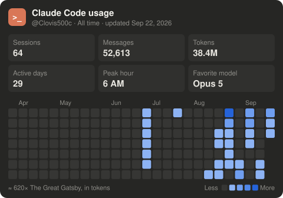

# ClaudeUsageChart

<sub>Made by [**@Clovis500c**](https://github.com/Clovis500c)</sub>

Your **Claude Code stats card** — sessions, prompts, tokens, models, tools and an activity heatmap — in your GitHub profile README, refreshed automatically.



## Quick start

```bash
npx claude-usage-chart setup
```

It will:
1. read your local Claude Code history (`~/.claude/projects`),
2. render the card (dark by default),
3. upload it to your profile repo (`<you>/<you>` by default),
4. ask how often it should refresh (every hour → once a week, or never),
5. print the snippet to paste in your `README.md`:

```html
/<you>/HEAD/claude-stats/claude-stats.svg" />
```

## Themes

| `--theme` | Result |
|---|---|
| `dark` (default) | Dark card, like the Claude app |
| `light` | Light card |
| `auto` | Both versions; the README shows the one matching the visitor's GitHub theme (the snippet uses a `<picture>` tag) |

Requirements: Node 18+, and either the [GitHub CLI](https://cli.github.com) logged in (`gh auth login`) or a `GITHUB_TOKEN` env var with `contents: write` on the target repo.

## Commands

| Command | What it does |
|---|---|
| `claude-usage-chart setup` | Guided setup (publish + refresh frequency + snippet) |
| `claude-usage-chart` | Write `claude-stats.svg` in the current folder |
| `claude-usage-chart push` | Render and upload (only commits when something changed) |
| `claude-usage-chart schedule --every 1d` | Change the refresh frequency: `1h`, `6h`, `12h`, `1d`, `7d` |
| `claude-usage-chart unschedule` | Stop the automatic refresh |

### How the automatic refresh works

A job (Windows Task Scheduler, or cron on macOS/Linux) wakes up every hour and only uploads once the chosen interval has passed since the last upload. If your computer was off when a refresh was due, it happens within an hour of it being back on. Nothing is uploaded when the numbers haven't changed.

Options: `--hide-tools`, `--name <user>` (shown on the card, defaults to the repo owner), `--theme dark|light|auto`, `--lang en|fr`, `--range all|30d|7d`, `--dir <folder in repo>`, `--branch <name>`, `--out <local folder>`.

## Why not a GitHub Action like the snake?

The contribution snake reads data that lives on GitHub. Your Claude usage only lives **on your computer** — Anthropic has no public API for personal (Pro/Max) usage. So the refresh runs locally (Windows Task Scheduler, or cron on macOS/Linux) and pushes the SVG; the card updates whenever your machine is on.

## Privacy

Only aggregated numbers end up in the SVG: counts, token totals, per-day prompt counts, model names and the names of your most-used tools. No prompts, code, file names or project names leave your machine. Use `--hide-tools` to leave tool names off the card.

## How the numbers are computed

Claude Code transcripts (`~/.claude/projects/**/*.jsonl`) contain a lot of repetition, so they are de-duplicated before counting:
- one API response is written as several lines (one per content block), each repeating the same token usage → each response is counted **once**;
- resumed sessions copy earlier messages into a new file → each message id is counted **once**;
- most "user" lines are tool results or system notices → only messages you actually typed count as **prompts**.

| Stat | Definition |
|---|---|
| Sessions | Distinct Claude Code sessions |
| Prompts | Messages you typed (no tool results, no system messages) |
| Active days · Longest streak | Days with at least one prompt or response · most consecutive such days |
| Tokens generated | Output tokens: everything Claude wrote (text, code, tool calls, thinking) |
| Tool calls · Top tools | Tool uses Claude made (each counted once) · the most frequent ones |
| Peak hour | Hour of the day with the most prompts |
| Favorite model | Model that generated the most output tokens |
| Heatmap | Prompts per day over the last 26 weeks |
| **Tokens** bar | *Written by Claude* = output · *Added to context* = input + cache writes (files read, command results…) · *Re-read from cache* = cache reads: on every step Claude re-reads the whole conversation, which is why this part is by far the biggest |
| **Models** bar | Share of output tokens per model |
| Book line | Output tokens compared with a book's length (see below) |

### The book comparison

Book lengths use commonly cited English word counts, converted at ~1.3 tokens per word, so it's an estimate (output also contains code and tool calls). The card picks the longest book Claude's output fits into at least 10 times, so the number stays readable:

| Book | Words |
|---|---|
| The Great Gatsby | 47,094 |
| Harry Potter and the Philosopher's Stone | 76,944 |
| The Hobbit | 95,356 |
| Moby-Dick | 206,052 |
| The Lord of the Rings | 481,103 |
| The King James Bible | 783,137 |
| In Search of Lost Time | 1,267,069 |

Subagent traffic is excluded. Numbers can differ from the Claude app's stats card, which sums the repeated lines.

Note: stats only cover the transcripts still on disk. Claude Code can clean up old transcripts (see the `cleanupPeriodDays` setting in `~/.claude/settings.json`); raise it to keep a longer history.

## Credits

Created and maintained by [**Clovis500c**](https://github.com/Clovis500c). If you use it, a star on the repo is appreciated ⭐

## License

MIT © Clovis500c
