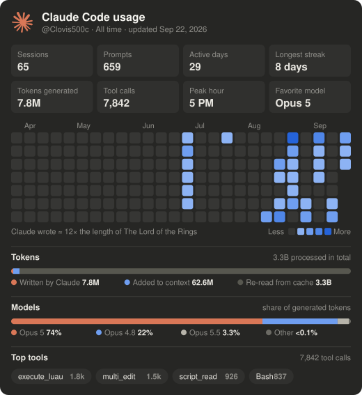
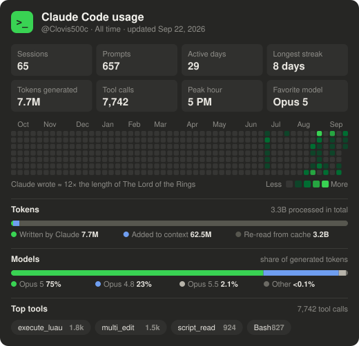
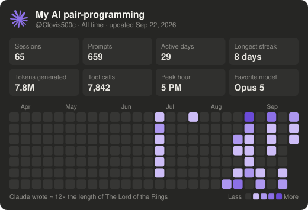
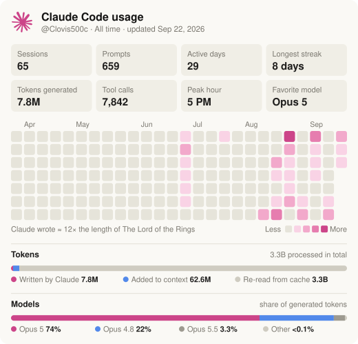
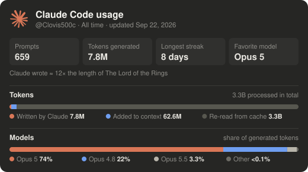
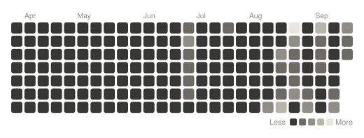

<div align="center">

# Claude Stats

**Your Claude Code usage, as a live stats card for your GitHub profile.**

Sessions, prompts, tokens, models, top tools and an activity heatmap — computed locally from your Claude Code history, rendered as a self-contained SVG and refreshed automatically.

[](https://github.com/Clovis500c/claude-stats/actions/workflows/ci.yml)
[](https://github.com/Clovis500c/claude-stats/releases/latest)
[](https://nodejs.org)
[](LICENSE)



</div>

---

## Contents

- [Features](#features)
- [Requirements](#requirements)
- [Quick start](#quick-start)
- [Commands](#commands)
- [Customization](#customization)
- [How it works](#how-it-works)
- [Privacy](#privacy)
- [How the numbers are computed](#how-the-numbers-are-computed)
- [Troubleshooting](#troubleshooting)
- [Upgrading from `claude-usage-chart`](#upgrading-from-claude-usage-chart)
- [Uninstall](#uninstall)
- [Contributing](#contributing)
- [Disclaimer](#disclaimer) · [License](#license)

## Features

- **Complete overview** — sessions, prompts, active days, longest streak, generated tokens, tool calls, peak hour and favorite model.
- **Activity heatmap** — prompts per day, from 8 to 52 weeks.
- **Token and model breakdown** — what Claude wrote, what was added to context, what was re-read from cache, and the share of each model.
- **Honest numbers** — transcripts are de-duplicated before counting (see [below](#how-the-numbers-are-computed)).
- **Fully customizable** — dark, light or auto theme, 6 heatmap palettes, accent color, title, tiles and sections.
- **Automatic refresh** — from every hour to once a week, only committing when something changed.
- **Private by design** — only aggregated numbers leave your machine.
- **Zero dependencies** — a single Node.js CLI, works on Windows, macOS and Linux.

## Requirements

- [Node.js](https://nodejs.org) **18 or later**
- [Claude Code](https://docs.anthropic.com/en/docs/claude-code) with some local history in `~/.claude/projects`
- A GitHub token, from either:
  - the [GitHub CLI](https://cli.github.com) (`gh auth login`) — recommended, or
  - a `GITHUB_TOKEN` environment variable with write access to the target repository (`contents: write`)

## Quick start

Install the latest release, then run the guided setup:

```bash
npm i -g https://github.com/Clovis500c/claude-stats/releases/latest/download/claude-stats.tgz
claude-stats setup
```

Or run it without installing anything:

```bash
npx -y --package=https://github.com/Clovis500c/claude-stats/releases/latest/download/claude-stats.tgz claude-stats setup
```

The setup will:

1. read your local Claude Code history (`~/.claude/projects`);
2. render the card (dark theme by default);
3. upload it to your profile repository (`<you>/<you>` by default);
4. ask how often it should refresh (every hour to once a week, or never);
5. print the snippet to paste into your `README.md`:

```html
/<you>/HEAD/claude-stats/claude-stats.svg" />
```

> [!TIP]
> Preview the card locally before publishing anything:
> `claude-stats --palette green --out preview` writes `preview/claude-stats.svg`.

## Commands

| Command | Description |
|---|---|
| `claude-stats setup` | Guided setup: publish, choose the refresh frequency, get the snippet |
| `claude-stats` | Write `claude-stats.svg` to the current folder (or `--out <dir>`) |
| `claude-stats push` | Render and upload; only commits when the card changed |
| `claude-stats schedule --every <freq>` | Set the refresh frequency: `1h`, `6h`, `12h`, `1d`, `7d` |
| `claude-stats unschedule` | Stop the automatic refresh |
| `claude-stats --help` | Show every option |
| `claude-stats --version` | Show the installed version |

## Customization

`setup` asks for the main options; every option can also be passed on the command line. Options are remembered by the automatic refresh.

### Appearance

| Option | Description | Default |
|---|---|---|
| `--theme <dark\|light\|auto>` | Card theme; `auto` follows the visitor's GitHub theme | `dark` |
| `--palette <name>` | Heatmap colors: `blue`, `green`, `orange`, `purple`, `pink`, `gray` | `blue` |
| `--accent <hex>` | Color of the Claude logo and of the bars | `#d97757` |
| `--title <text>` | Card title | `Claude Code usage` |
| `--weeks <8-52>` | Number of weeks in the heatmap | `26` |
| `--tiles <list>` | Stat tiles to show, in order (see below) | first 8 |
| `--hide <list>` | Sections to leave out: `header`, `tiles`, `heatmap`, `book`, `tokens`, `models`, `tools` | none |
| `--transparent` | No card background | off |

Available tiles: `sessions`, `prompts`, `activeDays`, `streak`, `generated`, `toolCalls`, `peakHour`, `favorite`, `responses`, `processed`.

### Content and publishing

| Option | Description | Default |
|---|---|---|
| `--lang <en\|fr>` | Card language | `en` |
| `--range <all\|30d\|7d>` | Period covered by the numbers (the heatmap always shows its full length) | `all` |
| `--name <user>` | Name shown in the header | repository owner |
| `--repo <owner/name>` | Target repository | `<you>/<you>` |
| `--dir <path>` | Folder inside the repository | `claude-stats` |
| `--branch <name>` | Target branch | repository default |

### Examples

| | |
|---|---|
| <br>`--palette green --accent "#39d353" --weeks 52` | <br>`--palette purple --accent "#8c70e6" --title "My AI pair-programming" --hide tokens,models,tools` |
| <br>`--theme light --palette pink --accent "#cc4589" --hide tools` | <br>`--tiles prompts,generated,streak,favorite --hide heatmap,tools --palette orange` |
| <br>`--hide header,tiles,book,tokens,models,tools --palette gray --transparent` | |

### Light and dark mode

With `--theme auto`, two files are published (`claude-stats.svg` and `claude-stats-light.svg`) and `setup` prints a `<picture>` snippet so GitHub shows the one matching each visitor's theme.

## How it works

```
~/.claude/projects/**/*.jsonl ──► aggregate (local) ──► SVG card ──► GitHub contents API ──► your README
```

### Why not a GitHub Action?

Tools like the contribution snake read data that already lives on GitHub. Your Claude Code usage only lives **on your computer** — there is no public API for personal (Pro/Max) usage. The refresh therefore runs locally and pushes the SVG; the card updates whenever your machine is on.

### Automatic refresh

A job (Task Scheduler on Windows, cron on macOS and Linux) wakes up every hour and only uploads once the chosen interval has elapsed since the last successful upload. If your computer was off when a refresh was due, it happens within an hour of being back on. Nothing is committed when the numbers haven't changed.

## Privacy

Only aggregated numbers end up in the SVG: counts, token totals, per-day prompt counts, model names and the names of your most-used tools. **No prompts, code, file names or project names ever leave your machine.** Use `--hide tools` to leave tool names off the card.

The GitHub token is read from `gh` or `GITHUB_TOKEN` at run time and is never stored by this tool. The only file it writes outside the output folder is `~/.claude-usage-chart.json`, which records the time of the last upload per repository.

## How the numbers are computed

Claude Code transcripts (`~/.claude/projects/**/*.jsonl`) contain a lot of repetition, so they are de-duplicated before counting:

- one API response is written as several lines (one per content block), each repeating the same token usage → each response is counted **once**;
- resumed sessions copy earlier messages into a new file → each message is counted **once**;
- most "user" lines are tool results or system notices → only messages you actually typed count as **prompts**;
- subagent traffic is excluded.

| Stat | Definition |
|---|---|
| Sessions | Distinct Claude Code sessions |
| Prompts | Messages you typed (no tool results, no system messages) |
| Active days · Longest streak | Days with at least one prompt or response · most consecutive such days |
| Tokens generated | Output tokens: everything Claude wrote (text, code, tool calls, thinking) |
| Tool calls · Top tools | Tool uses by Claude, each counted once · the most frequent ones |
| Peak hour | Hour of the day with the most prompts |
| Favorite model | Model that generated the most output tokens |
| Heatmap | Prompts per day over the last `--weeks` weeks |
| **Tokens** bar | *Written by Claude* = output · *Added to context* = input + cache writes (files read, command results…) · *Re-read from cache* = cache reads — Claude re-reads the whole conversation at every step, which is why this part is by far the largest |
| **Models** bar | Share of output tokens per model |
| Book line | Output tokens compared with the length of a well-known book |

Numbers can differ from the Claude app's stats card, which sums the repeated lines.

<details>
<summary><strong>The book comparison</strong></summary>

Book lengths use commonly cited English word counts, converted at ~1.3 tokens per word, so the comparison is an estimate (output also contains code and tool calls). The card picks the longest book Claude's output fits into at least 10 times, so the number stays readable.

| Book | Words |
|---|---:|
| The Great Gatsby | 47,094 |
| Harry Potter and the Philosopher's Stone | 76,944 |
| The Hobbit | 95,356 |
| Moby-Dick | 206,052 |
| The Lord of the Rings | 481,103 |
| The King James Bible | 783,137 |
| In Search of Lost Time | 1,267,069 |

</details>

## Troubleshooting

| Problem | Solution |
|---|---|
| `No Claude Code transcripts found` | Use Claude Code at least once. If you set `CLAUDE_CONFIG_DIR`, the tool reads `$CLAUDE_CONFIG_DIR/projects` instead of `~/.claude/projects`. |
| `No GitHub token` | Run `gh auth login`, or set `GITHUB_TOKEN`. |
| `GitHub PUT … → 403` / `404` | The token can't write to the repository: check `--repo` and that the token has `contents: write` access. |
| The card on GitHub looks outdated | GitHub caches images for a few minutes. Check that the SVG in the repository was updated, then reload. |
| History looks shorter than expected | Claude Code deletes old transcripts after `cleanupPeriodDays` (see `~/.claude/settings.json`). Raise it to keep a longer history. |
| The refresh doesn't run | Run `claude-stats push` manually to see the error, then `claude-stats schedule --every 1d` to recreate the job. |

## Uninstall

```bash
claude-stats unschedule
npm rm -g claude-stats
rm ~/.claude-usage-chart.json   # optional: last-upload bookkeeping
```

Then remove the `claude-stats/` folder and the snippet from your profile repository.

## Contributing

Issues and pull requests are welcome.

```bash
git clone https://github.com/Clovis500c/claude-stats.git
cd claude-stats
npm test                 # unit tests (node:test, no dependencies)
npm run preview          # render your own card to preview/claude-stats.svg
```

| Path | Role |
|---|---|
| `bin/cli.js` | Command-line interface, option parsing and guided setup |
| `src/collect.js` | Reads and de-duplicates transcripts, computes the stats |
| `src/render.js` | Renders the SVG card (themes, palettes, translations) |
| `src/books.js` | Book lengths for the output comparison |
| `src/github.js` | Uploads through the GitHub contents API |
| `src/schedule.js` | Automatic refresh (Task Scheduler / cron) |
| `test/` | Unit tests |

### Releasing

1. Bump `version` in `package.json` and move the *Unreleased* notes in [`CHANGELOG.md`](CHANGELOG.md) under the new version.
2. Tag and push (`git tag v0.6.0 && git push origin v0.6.0`), or run the **Release** workflow from the Actions tab, which tags the current commit for you.
3. The [release workflow](.github/workflows/release.yml) runs the tests, packs `claude-stats.tgz` and publishes the GitHub release.

## Credits

Created and maintained by [**Clovis500c**](https://github.com/Clovis500c). If you find it useful, a ⭐ on the repository is appreciated.

## Disclaimer

This is a community project, not affiliated with or endorsed by Anthropic. Claude and the Claude logo are trademarks of Anthropic, used here only to identify the product the stats are about. The logo path comes from [Simple Icons](https://simpleicons.org) (CC0).

## License

[MIT](LICENSE) © Clovis500c
